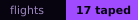

# HYPERCOLOR ASTEROIDS





A neon vector rewrite of the 1979 arcade game. No build step, no dependencies,
no network. **[Play it in the browser](https://durchnull.github.io/hypercolor-asteroids/)**,
or open `index.html` from a clone.

> **Anyone can play it. Fewer can change it.** Clone, prompt *"add an asteroid
> storm"*, open the PR — that is where developers actually battle.


## The game on the screen

Two pilots share one keyboard; player two drops in mid-wave, and anyone out of
lives can buy back in. Out there: rocks that split, a kraken that dives and
surfaces underneath you, portals your shots also fall through, a grapple that
swings you rather than reels you in, a planet too big for the screen, and a
smuggler with one enormous laser. The splash screen's field guide is generated
from the code, so it is never out of date.


## The game behind the game

The other half of it is played in the repository. Somebody lands a version
tonight; the next person pulls on Thursday, presses ENTER, and finds out what
changed **by playing it**. No changelog, no announcement. The diff is not the
deliverable — the surprise is.

## A session with Claude sounds like this

- *"what did the others land since I last played?"* — or `/scout`
- *"add comets, and make them come in threes"*
- *"an event that flips everyone's controls for ten seconds"* — or `/event`
- *"the kraken is too easy now"*
- *"read the black box"* — paste the tape off the game-over screen
- *"land it"* — or `/land`

## You build the events everybody else flies into

You can drop an ambush into the game — the lights go out mid-wave, rock closes
in from every side but one, something comes through a portal that should not
fit. It goes in a file with your name on it, and your name is the whole
mechanic:

> **An event never fires for the person who wrote it.**

So you build it, everyone else meets it, and you never once see it from the
inside. Nobody can disarm the one that is waiting for them, either. New pilots
are safe until they write their first: the field does not ambush the unarmed.


## The black box: you have to fly what you land

Every flight tapes itself. Die, and the game-over screen hands you a sealed
black box; paste it back and it lands on the
[flight records](docs/RANKINGS.md). One tape buys three landings — three
versions with your name on them — and nobody writes a tape by hand. They come
off the glass or they are not tapes.


## Bending a rule makes your game harder

[GOLDEN_RULES.md](GOLDEN_RULES.md) is the whole rulebook, one page. Red lines
are hard stops; budgets you may spend, in writing, under your own name. Nothing
is blocked and nobody is scolded — overrides are counted out of the git history
into a ledger nobody edits by hand, your ambushes start coming sooner, and
clean landings ease it back off. It is a difficulty setting made of your own
behaviour.

Every commit also writes itself into
[the chronicle](https://durchnull.github.io/hypercolor-asteroids/docs/): a
cover, a page per version, and your own line about it quoted a year from now.

## Getting in

```sh
git clone https://github.com/durchnull/hypercolor-asteroids   # or fork it
cd hypercolor-asteroids
tools/golden-check.sh --install   # wire in the referee
tools/whoami.sh                   # say who you are, so your own events go quiet
open index.html                   # find out what the others did to you
```

On Windows, double-click `index.html` instead of that last line; if your
browser is strict about local files, `python3 -m http.server 8000` and go to
`localhost:8000`. [Before you can play](docs/requirements.md) has the rest.

Your meter starts at zero, which buys you three landings — three versions of
your own — before anybody asks to see a tape. Spend one on something small:
make the kraken meaner, give the blaster a nastier noise, repaint the whole
cabinet a colour nobody asked for. Each of those is one file, none of them can
break anybody else, and every one counts as a full turn.

Talking to claude is the quick way through it, and doing the same five steps by
hand is no slower — [CONTRIBUTING.md](CONTRIBUTING.md) walks you from a clone
to a pull request. The project is MIT, and what you contribute is contributed
under the same licence.

### What happens after you push

`main` takes pull requests and nothing else, from everybody including the
person who owns the place. A workflow reads your branch one commit at a time
and prints a verdict into the pull request: red lines fail it, budgets and
nudges are only ever mentioned, because the point was never that a machine
stops you. Another one labels it and puts your name on it.

Then a person presses merge — a merge commit, never a squash, because the
history is the scoreboard. If what you landed touched the game it becomes the
next numbered version, counted off the history rather than chosen by anybody,
and the chronicle and the ledger rewrite themselves on the way through.

## Where to look next

| | |
|---|---|
| [the chronicle](https://durchnull.github.io/hypercolor-asteroids/docs/) | every night this cabinet has had, written down while it was happening |
| [the flight records](docs/RANKINGS.md) | who flew, how far they got, and how it ended for them |
| [the rulebook](GOLDEN_RULES.md) | sixteen rules, eight of them unbendable, and the price of the rest |
| [taking a turn by hand](CONTRIBUTING.md) | the long way round, from a clone to a pull request, no help required |
| [the code of conduct](CODE_OF_CONDUCT.md) | the game is hostile on purpose; aim it at the ship, never at the pilot |
| [behind the glass](docs/ARCHITECTURE.md) | how the cabinet is wired, and where a new idea plugs into it |
| [the referee's briefing](CLAUDE.md) | what claude is told before it sits down at this keyboard |
| [before you can play](docs/requirements.md) | what your machine needs, Windows included |
